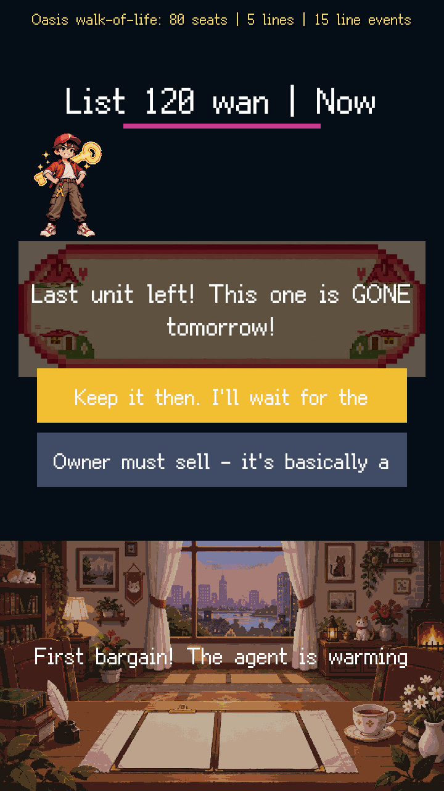
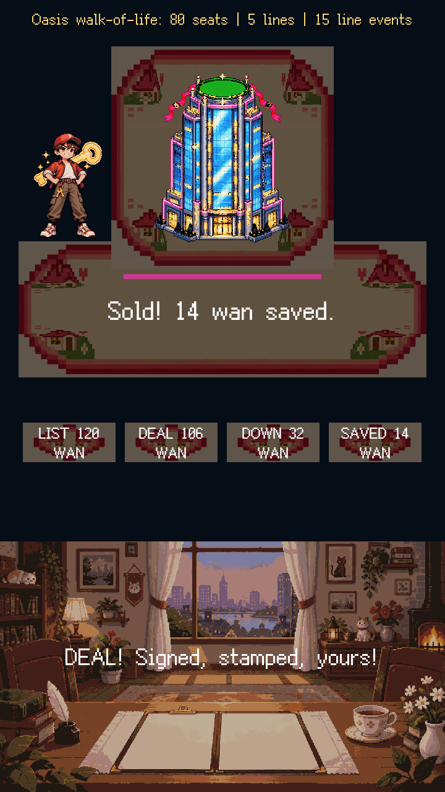
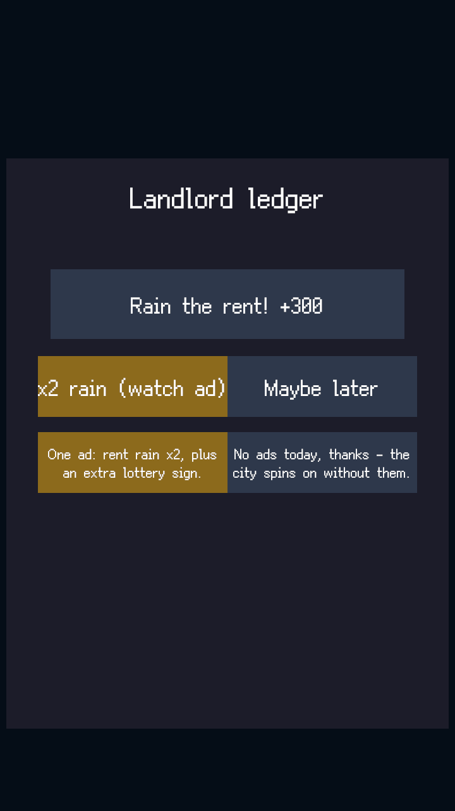
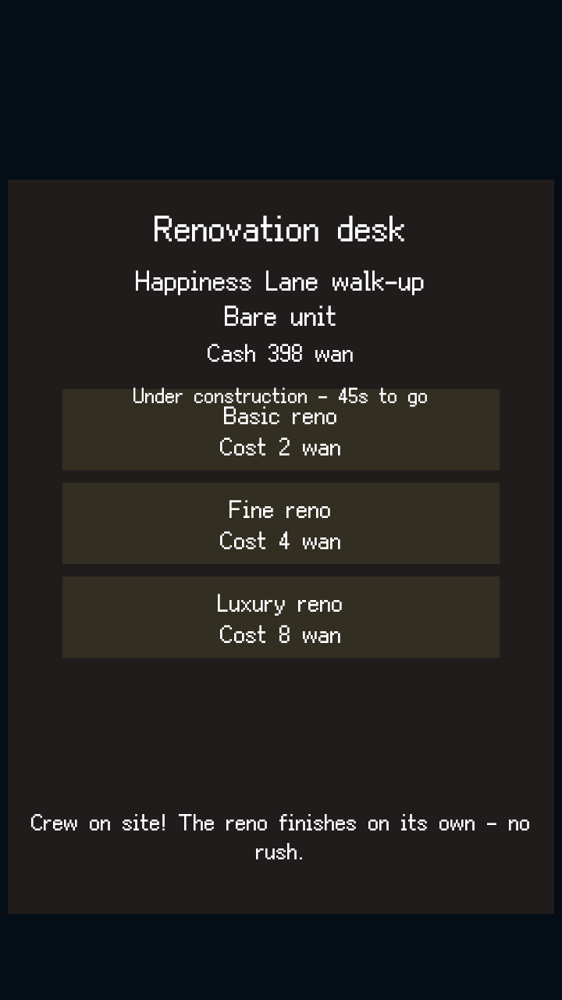
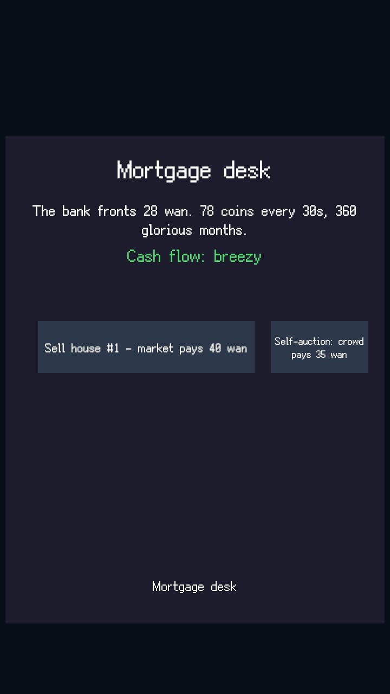
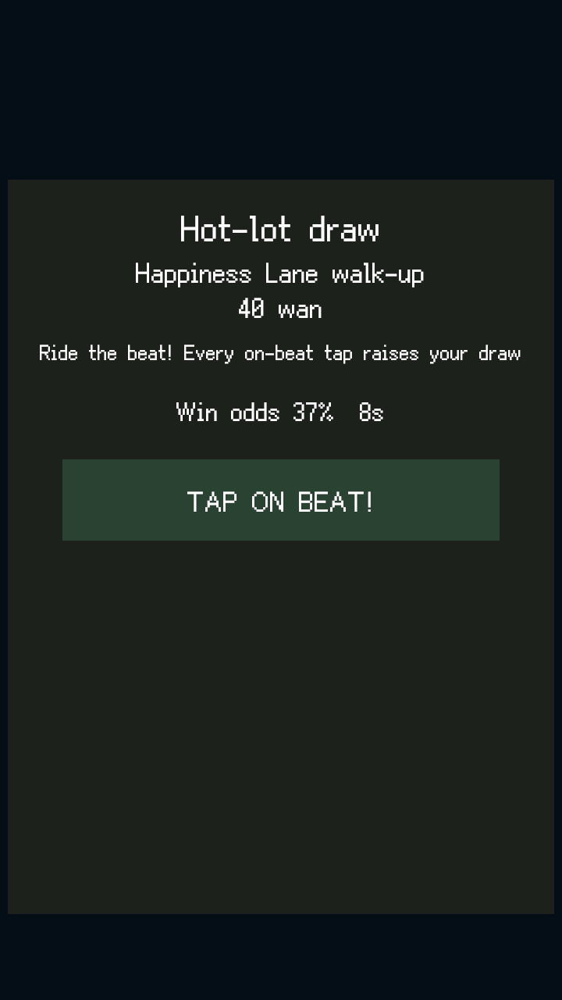
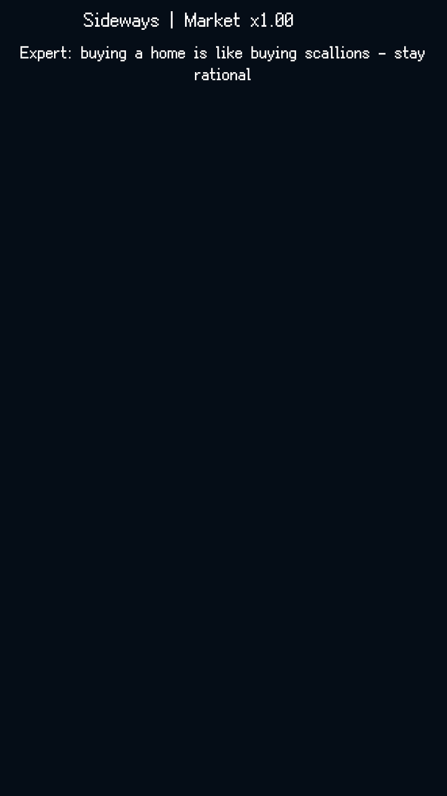
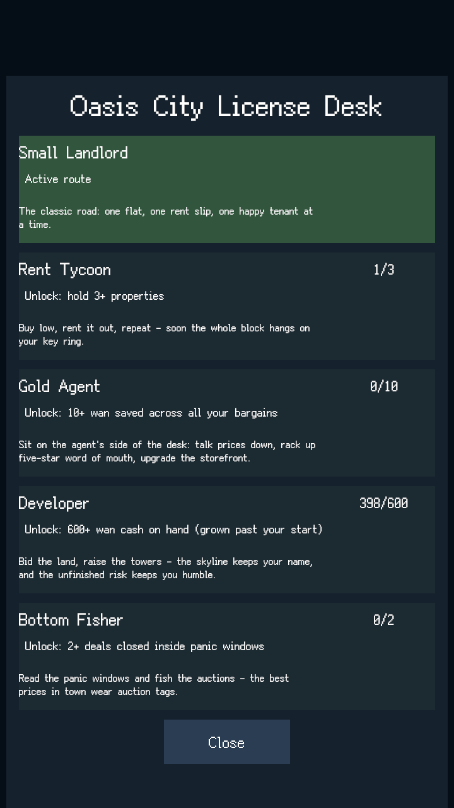
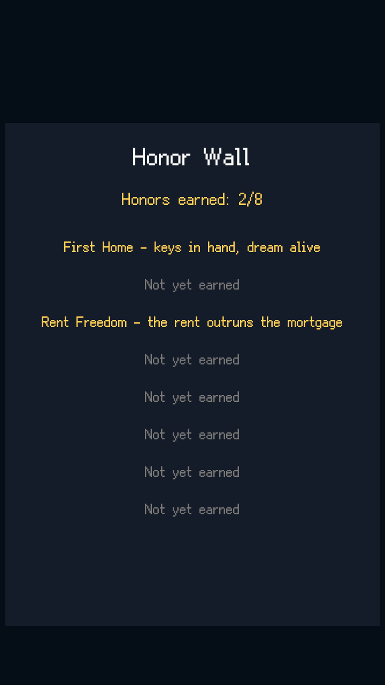

# 《我有一栋楼》（Crazy Estate）操作说明书

> 软件名称：我有一栋楼（英文名：Crazy Estate）
> 当前版本：v4.1.0+build4
> 文档性质：草版（依据开发仓库实测数据起草，图位0-8已补齐——图位0为游戏图标成品图、图位1-8为实机截图，定稿权在著作权人）
> 草版日期：2026年9月27日

【图位0：游戏图标（像素风成品图）】

## 一、软件概述

《我有一栋楼》（Crazy Estate）是一款「再不上车，就晚了！」置业经营题材的像素城市小游戏：玩家从一间老破小砍价起家，在中介话术气泡里限时点按反驳、砍掉房价水分，签约成交点亮城市天际线；把房产装修出租，租金按拍跳字成金币雨；看市场周期新闻梗择机转卖，用首付与房贷杠杆撬动下一套，最终把全架空城市「绿洲市」的天际线全款拿下。房源自带公摊双面积落差（建面89㎡/套内61㎡式荒诞揭露）与学区、江景、历史名人故居等标签溢价；热盘摇号连点中签、老楼拆迁「拆」字盖章金币雨；市场在抢购潮、横盘、恐慌抛售三态间循环，新闻梗滚动条播报众生相。小房东、包租公、金牌中介、开发商、抄底炒客五业执照多线发展，十二章剧情随玩法里程碑解锁。单次决策为秒级短窗（买哪套/砍多狠/卖不卖），每分钟内可产出一个可分享时刻；离线照常收租（挂机零逼肝）；广告均为用户主动触发的激励视频，零广告可通关全部内容。游戏城市全架空（绿洲市），题材影射为现象级喜剧夸张，与现实任何城市、房企、政策无关。

软件面向的发布渠道：

- 微信小游戏（首发规划渠道，客户端内进入即玩）；
- 抖音小游戏（跟发规划渠道）；
- 网页平台（WebGL，浏览器即点即玩，全球层候选）。

## 二、运行环境

- 移动端（微信/抖音小游戏，规划）：微信/抖音客户端内进入即玩，无需下载安装；
- 桌面端（WebGL）：Chrome、Edge 等支持 WebGL 的现代浏览器，打开游戏页面即玩；
- 操作方式：单指操作设计，全程一根手指完成看房、砍价、装修与转卖决策。

## 三、主要功能

1. **话术砍价对决（玩法签名）**：中介弹出经典话术气泡（「错过再无」「业主急售」「地铁规划中」），玩家限时点按反驳气泡，砍掉真金白银，「砍掉5万！」数字爆闪；话术-反驳对照表为喜剧文案主库；
2. **房源板与公摊揭露**：房源卡（H01老破小至H10城市之冠）标注建面/套内双面积，公摊水分即砍价空间；学区、地铁、江景、「历史名人故居」等标签提供租金售价乘数，标签随事件风向增减；
3. **签约成交与收租雨**：砍价到位签约盖章演出（成交章+欢呼音效）；房产入租赁板后租客入住、租金按拍跳字金币雨；离线照常收租，回归弹出结算摘要（「你不在时租金到账，房客们过得不错」）；
4. **装修档位与翻车喜剧**：装修分档位开工，豪装可能「效果图仅供参考」翻车——翻车为喜剧事件卡而非惩罚；工期支持可选加速；
5. **房贷杠杆与断供危机**：首付+月供压力表三色区（绿/黄/红），连续红区触发银行危机幕（银行来电演出）；激励视频=银行宽限（可选救急），卖房兜底清债即关危机幕，永零死局；
6. **热盘摇号与拆迁暴富**：热盘开摇连点节奏中签即暴击时刻；老楼随机拆迁事件触发「拆」字盖章演出与金币雨；
7. **市场周期与新闻梗**：市场在抢购潮→横盘→恐慌抛售三态循环，新闻梗滚动条播报喜剧标题（影射众生相）；玩家择机转卖，资产涨跌=决策真价值；
8. **五业执照多线发展**：小房东、包租公、金牌中介、开发商、抄底炒客五线执照可切换，各线专属图鉴、事件与终局档，终局为「绿洲市风云人物」五线成就墙；
9. **剧情章门与租客图鉴**：十二章随玩法里程碑解锁（首成交、首拆迁、首断供等），无时间墙零死局；租客群像图鉴（包租婆、二房东、网红租客等）差评图鉴化收藏，零挫败压力；
10. **成就荣誉墙与城市之冠**：八项成就含「零广告通关」宣言成就；集齐 H10 城市之冠点亮城市天际线；
11. **激励视频三类目与本地存档**：救急（银行宽限）、加速（装修/收租）、翻倍（离线结算）三类目独立限次、全部用户主动触发、类目频次硬顶；游戏进度保存于本地设备，无需注册登录。

## 四、操作说明

### 4.1 启动与首次砍价成交

游戏启动直接进入绿洲市房源板：开场一句话卖点字幕「再不上车，就晚了！」。点开第一张房源卡查看双面积与标签，进入砍价对决：中介话术气泡弹出，限时点按对应反驳气泡，水分数字被逐层砍掉；砍价到位后签约盖章，成交章落纸、金币音效到账，首套房三分钟内完成「看房-砍价-成交」闭环。

【图位1：首次砍价对决与成交盖章（实机截图）】

### 4.2 收租雨与租客入住

成交房产自动进入租赁板：租客拖家带口入住（群像演出），租金按拍跳字成金币雨；离线归来弹出结算摘要面板，一键收下离线租金。

【图位2：租赁板收租雨（实机截图）】

### 4.3 装修档位与翻车事件

在装修面板选择档位开工：豪装预算高但可能翻车（「效果图仅供参考」事件卡弹出，喜剧演出零惩罚）；工期条推进，可选激励视频加速。

【图位3：装修档位与翻车事件卡（实机截图）】

### 4.4 房贷柜台与压力表

房贷柜台显示首付与月供：压力表三色区实时变化（绿区安全、黄区吃紧、红区断供预警）；连续红区触发银行危机幕——银行来电演出后可选择激励视频获得宽限，或卖房兜底清债关闭危机幕，全程零死局。

【图位4：房贷压力表与银行危机幕（实机截图）】

### 4.5 热盘摇号与拆迁事件

热盘开盘进入摇号小玩法：连点节奏保持手速，中签触发暴击演出（价格倒挂即赚）；城市里老楼随机触发拆迁事件，「拆」字盖章落下、金币雨倾盆。

【图位5：摇号中签与拆迁盖章（实机截图）】

### 4.6 市场周期与转卖

屏幕上方新闻梗滚动条播报市场风向（抢购潮/横盘/恐慌抛售三态）；在租赁板选择房产择机转卖，转卖结算面板显示真实差价收益——低买高卖全凭眼光与节奏。

【图位6：新闻梗滚动条与转卖结算（实机截图）】

### 4.7 五业执照与剧情章门

执照面板切换五线（小房东/包租公/金牌中介/开发商/抄底炒客）：每线独立进度与专属玩法面（中介线接单砍价、开发商线拿地盖楼开盘等）；十二章章门随玩法里程碑逐章解锁，章节过场挂可选风味增益（零剧情玩家基线照样通关）；租客图鉴与差评文学随时翻看。

【图位7：五业执照面板与章节过场（实机截图）】

### 4.8 成就荣誉墙与终局

荣誉墙收录八项成就（含零广告通关宣言）；集齐 H10 城市之冠点亮天际线终局演出，五线成就墙「绿洲市风云人物」留名收官。

【图位8：荣誉墙与终局天际线（实机截图）】

## 五、注意事项

- 本游戏无需下载安装（小游戏版与网页版均为即点即玩）；
- 广告均为用户主动触发的激励视频，可选择观看，零广告可通关全部内容；
- 市场行情、事件流与租客群像均为本地生成演出，无联网对战内容；
- 游戏城市全架空（绿洲市），内容纯属娱乐影射，与现实城市、房企、政策无关；市场行情为喜剧夸张演出，非投资建议；
- 游戏进度保存于本地设备，无强制登录环节。
